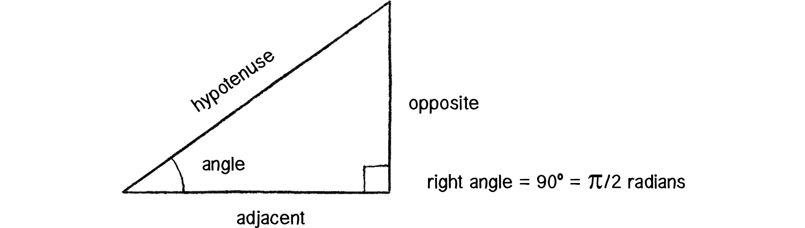
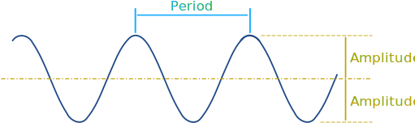

# The Nature of Code

Daniel Shiffman's Nature of Code: https://natureofcode.com/

Repo: https://github.com/nature-of-code/noc-examples-processing

## Vectors

They have direction and magnitude.

A vector object usually contains `x` and `y` properties, which are manipulated at the same time to move things around.

```javascript
class Vector {
  constructor(x, y) {
    this.x = x;
    this.y = y;
  }
}
```

Creating a new instance of `Vector` and assigning it to the `location` constant:

```javascript
const location = new Vector(50, 100);
```

### Velocity

`velocity` is how the position of a vector changes over time.

This can also be described as a vector:

```javascript
const velocity = new Vector(1, 2);
```

### Add and Subtract

```javascript
class Vector {
  // ...
  add(vector) {
    this.x += vector.x;
    this.y += vector.y;
  }

  subtract(vector) {
    this.x -= vector.x;
    this.y -= vector.y;
  }
}
```

Now we can add velocity to location:

```javascript
location.add(velocity);
```

In processing this is done as a part of an animation loop.  So we end up calling this a number of times a second.

### Multiply and Divide

These are really about scaling a vector.

```javascript
class Vector {
  // ...
  multiply(vector) {
    this.x *= vector.x;
    this.y *= vector.y;
  }

  divide(vector) {
    this.x /= vector.x;
    this.y /= vector.y;
  }
}
```

Note, that subtracting one vector from another gives the vector between the two locations. For example, if you want a line from the center of the window to the mouse position, you subtract the mouse position from the center of the window position.

### Magnitude

This is the length of the vector from the origin, figured out with Pythagorean:

```javascript
class Vector {
  // ...
  get magnitude() {
    return Math.sqrt(this.x * this.x + this.y * this.y);
  }
}
```

### Normalize

Take the magnitude and turn it into 1.

```javascript
class Vector {
  // ...
  normalize() {
    this.x /= this.x;
    this.y /= this.y;
  }
}
```

### Set magnitude

This just normalizes and multiplies in one step `location.magnitude = 50`

```javascript
class Vector {
  // ...
  set magnitude(newMagnitude) {
    this.normalize();
    this.multiply(newMagnitude);
  }
}
```

## Acceleration

A vector that adjusts velocity over time.  So, the change in velocity over time.  In the case of Processing, it's the change in velocity per animation frame.

* Acceleration changes velocity
* Velocity changes location

```javascript
const location = new Vector(0, 0);
const velocity = new Vector(0, 0);
const acceleration = new Vector(0.001, 0.001);

// in animation loop
velocity.add(acceleration);
location.add(velocity);
// render
```

## Force

A vector that causes an object with mass to accelerate.

### Newton's Laws

1. An object at rest stays at rest and an object in motion stays in motion
1. Force equals mass times acceleration
1. For every action there is an equal and opposite reaction (forces always occur in pairs.  The two forces are of equal strength, but in opposite directions)

In our sketches we want to accumulate forces and apply them to an object.  For example, you might apply both gravity and wind to an object.

> "Acceleration equals the sum of all forces applied to an object".

### Friction

`Friction = normal force * friction coefficient`
`normal force = mass * gravity constant`

In Processing terms:

```javascript
const friction = velocity.get(); // copy of velocity vector
friction.normalize();
friction.mult(-1);
const frictionCoefficient = 0.1; // some arbitrary value
friction.mult(frictionCoefficient);
mover.applyForce(friction);
```

### Drag Force

Things like air, fluid, etc.

`Force of drag = -1/2 * density * magnitude of velocity squared * surface area * the coefficient of drag * velocity unit vector`

What if density and surface area equal 1? (You can make equations easier by assuming one.)

```javascript
const drag = mover.velocity.get();
drag.normalize();
const dragCoefficient = -0.1;
const speed = mover.velocity.get();
drag.mult(dragCoefficient * speed * speed);
mover.applyForce(drag);
```

### Gravitational Attraction

`Force of gravity = (gravitational constant * mass of the first object * the mass of the second object / distance squared) * unit vector`

```javascript
const force = moverPlanet.attractionForce(moverMoon);
moverMoon.applyForce(force);
moverMoon.update();

// moverPlanet#attractionForce
attractionForce(obj) {
  const force = Vector.sub(this.location, obj.location);
  const distance = force.mag();
  force.normalize();
  const gravitationalConstant = 1;
  const strength = (gravitationalConstant * this.mass * obj.mass) / (distance * distance)
  force.mult(strength);
}
```

## Angles

### Radians


If you have a circle with a radius of 1, then 1 radian equals the angle of the piece of that circle where the arc created also equals 1.

Also, with a radius of 1, the circumference of that circle is `2PI`.

### Degrees to radians

```javascript
const radians = 2 * Math.PI * (degrees / 360)
```

Processing has a `radians` method:

```javascript
const radians = p5.radians(degrees);
```

### Sohcahtoa

* **soh**: `sine = opposite / hypotenuse`
* **cah**: `cosine = adjacent / hypotenuse`
* **toa**: `tangent = opposite / adjacent`



The vector is the hypotenuse.

**Note**: The `Math.sin` function always produces values between 1 and -1.

### Figuring out the angle of a vector

The formula for tangent is:

`tangent(angle) = opposite / adjacent`

The problem is that we don't have the angle.

So, we use `arctangent` or `tan**-1`.

if this is true
`tangent(angle) = b`
then this is true
`a = arctangent(b)`

In our case:

```javascript
const angle = Math.atan2(velocityY / velocityX);
```

This uses the special `atan2` method.  The problem with `atan` is that there are two cases where the results are the same, but the angles are in exact opposite directions.  Instead of using `atan` with conditional logic for the positive and negative cases, most programming environments give you `atan2`, which does this for you.

## Angular Motion

Angular motion works in a similar way to cartesian motion.

```javascript
const angularAcceleration = 0.1;
const angularVelocity += angularAcceleration;
const angle += angularVelocity;
```

This is also where push and pop matrix start to come in handy:

```javascript
// say you have some position in cartesian space where the rect is
// supposed to be
const x = 100;
const y = 200;
const angle = 2.5;
p5.push();
p5.translate(x, y);
p5.rectMode(p5.CENTER);
p5.rect(0, 0, 50, 150);
p5.pop();
p5.rotate(angle);
```

## Rotating around another point

https://gamefromscratch.com/gamedev-math-recipes-rotating-one-point-around-another-point/

```javascript
const rotatedX = Math.cos(angle) * (point.x - center.x) - Math.sin(angle) * (point.y-center.y) + center.x;
const rotatedY = Math.sin(angle) * (point.x - center.x) + Math.cos(angle) * (point.y - center.y) + center.y;
```

## Translating Between Polar and Cartesian Coordinates

Designing with polar coordinates allows you move things in arcs, but you need to use the cartesian coordinate system to place items on the "stage".

`y = radius * sin(theta)`
`x = radius * cos(theta)`

The radius is the hypotenuse of the triangle.  In our case, this is the magnitude of the vector.

Theta is the angle in radians.

So, you can find the angle with `atan2` and you can find the x and y with `sin` and `cos`.

## Oscillation



`x = amplitude * cos(2 * PI * frameCount / period)`

Amplitude is the height of the wave and period is the frequency of, or distance between, the peeks in the wave.

However for our purposes, we can just shorten it to:

`x = amplitude * cos(some value that works)`

### Harmonic motion

You can use a sin function to create a smooth animation between -1 and 1 for an incrementing value.  This will allow you to nicely model harmonic motion in your sketches.

Since the sin function will always output values in the -1 to 1 range you can map these values to some other range and use in your sketches.

## Springs

Hook's Law: "the force of the spring is directly proportional to the extension of the spring"

`force = -k * x`

* **k**: spring constant (is it very springy or stiff?)
* **x**: the extension of the spring past it's rest length

The rest length is the length of x where the forces are at equilibrium.
